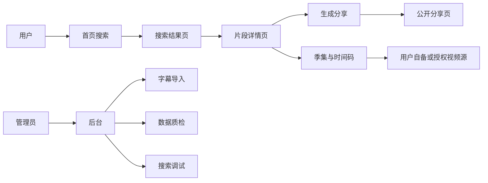
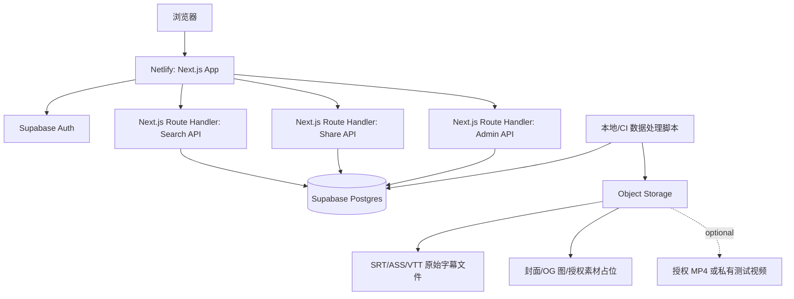
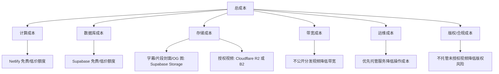
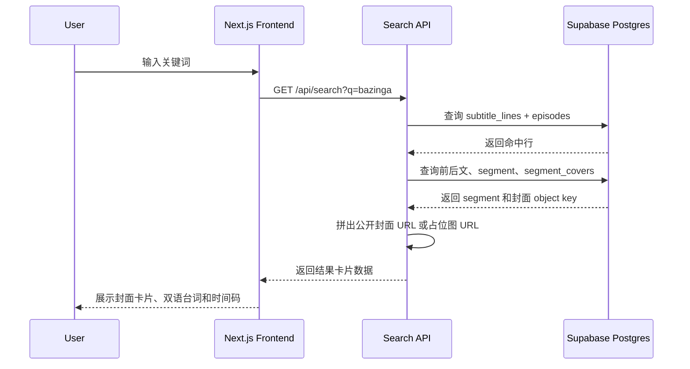
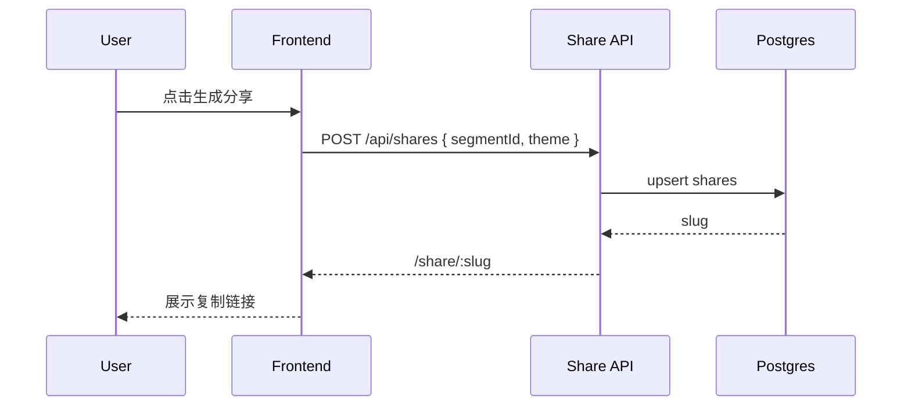

# BBT Search 实现手册

> 目标：基于《生活大爆炸》双语字幕，做一个支持关键词搜索台词、定位素材时间轴、展示素材封面卡片、生成分享页/分享卡片的 Web MVP。
>
> 默认边界：公开产品不托管、切片或分发未授权剧集视频；先索引字幕、时间码、剧集元数据和素材定位信息。视频播放只支持用户自备源、授权源或私有测试源。

## 0. 项目原则

### 0.1 MVP 一句话

用户输入关键词后，系统返回对应的素材卡片网格：每张卡片包含片段封面图、双语台词、季集、时间码、上下文片段，并允许用户生成一个可分享的台词素材链接。

### 0.2 不做什么

- 不做盗版影视播放站。
- 不在公开环境存储未授权 MP4 全片或切片。
- 不在 MVP 阶段做复杂视频剪辑、AI 角色识别、语义搜索、多剧集扩展。
- 不把语料处理结果只放本地文件，结构化关系必须入数据库。

### 0.3 目标视觉效果

最终前台效果以“搜索 + 素材封面网格”为核心，接近你提供的参考图：

- 页面顶部是极简搜索区：标题、搜索框、搜索按钮、示例关键词。
- 搜索结果是 3 列素材卡片网格，移动端变成 1 列或 2 列。
- 每张卡片必须有封面缩略图；图上叠加季集标签、时长、英文台词和中文字幕。
- 点击卡片进入片段详情页，展示更完整的上下文、时间码和分享按钮。
- 没有授权视频时，卡片仍然可以展示低分辨率封面图和时间码，但不提供公开视频播放。

### 0.4 推荐技术栈

- 前端：Next.js + TypeScript + Tailwind CSS + shadcn/ui。
- 部署：Netlify。
- 数据库：Supabase Postgres。
- 认证：Supabase Auth。
- 对象存储：Supabase Storage 存小文件；必要时 Cloudflare R2 存大对象。
- 搜索：Postgres Full Text Search + `pg_trgm` 起步。
- 数据脚本：Node.js/TypeScript，放在 `scripts/`。

选择 Next.js 的原因：

- 分享页需要 SEO 和 Open Graph 预览，Next.js 更合适。
- Netlify 支持 Next.js 部署。
- 可以先静态 UI，后接 Supabase 数据。

## 1. 总体架构

### 1.1 产品架构



注释：

- 前台只解决“找台词、看上下文、拿时间码、分享文本素材”。
- 视频源不属于 MVP 的公开资产。即使后续支持播放，也通过授权源或用户自备源实现。
- 后台是内部工具，用来降低语料清洗和搜索调试成本。

### 1.2 技术架构



注释：

- Next.js 页面负责展示和轻量 API 聚合。
- Supabase Postgres 保存所有结构化关系：剧集、字幕行、片段、对象存储 key、分享记录。
- 对象存储只保存文件本体，不承担关系查询。
- 数据脚本不暴露在前台，使用 service role key，仅在本地或受控 CI 手动执行。

### 1.3 代价架构 / 成本架构

最低成本策略：MVP 阶段不存 MP4，只存字幕、时间码、低分辨率片段封面图和分享配置。



注释：

- 计算成本：Next.js 页面和 API 使用 Netlify，MVP 流量下可先跑免费或低价档。
- 数据库成本：字幕数据约几万到十几万行，Postgres 足够；先不引入 Elasticsearch，避免额外服务费。
- 存储成本：字幕非常小，片段封面图压缩为 WebP 后也很小，适合 Supabase Storage；MP4 很大，公开托管会迅速带来存储和带宽成本。
- 带宽成本：视频是最大成本来源。MVP 不分发视频，成本会低很多。
- 运维成本：不建议一开始自建 MinIO，除非已有稳定服务器和备份方案。
- 合规成本：公开视频素材必须考虑版权授权。MVP 只展示文本、时间码和引用信息，风险更低。

### 1.4 成本最低的存储决策

| 数据类型 | MVP 处理方式 | 存储位置 | 是否入库 | 备注 |
| --- | --- | --- | --- | --- |
| 剧集元数据 | 保存 | Postgres | 是 | 季、集、标题、播出日期、封面 key |
| 原始 SRT/ASS/VTT | 保存 | Supabase Storage | 是，保存 object key | 便于追溯和重跑解析 |
| 清洗后字幕行 | 保存 | Postgres | 是 | 搜索主数据 |
| 片段关系 | 保存 | Postgres | 是 | 不存真实视频，只存时间窗 |
| 片段封面图 | 保存 | Supabase Storage | 是，保存 object key | 从合法/私有视频源抽帧生成 WebP |
| 分享配置 | 保存 | Postgres | 是 | slug、选中片段、主题 |
| 封面/OG 图 | 可保存 | Supabase Storage | 是，保存 object key | 小文件 |
| MP4 原片 | MVP 不保存 | 不存 | 只留外部来源/用户自备标记 | 避免成本和版权问题 |
| 授权 MP4 | 后续可选 | Cloudflare R2 / Backblaze B2 | 是，保存 object key | 只有拿到授权后启用 |
| 切片 MP4 | 后续可选 | Cloudflare R2 / Backblaze B2 | 是，保存 segment object key | 需要授权和生命周期策略 |

MinIO 决策：

- 不推荐作为最低成本 MVP 默认方案。MinIO 本身免费，但需要服务器、磁盘、备份、监控、升级和公网带宽。
- 只有在已经有低成本 VPS/NAS，且该项目主要是个人私有使用时，才考虑 MinIO。
- 公开产品优先用托管对象存储：Supabase Storage 存小文件，Cloudflare R2 存大文件。R2 的出站流量成本通常更友好，操作成本也低。

## 2. 语料库建设方案

### 2.1 合规边界

《生活大爆炸》属于受版权保护的影视作品。这个项目可以做“字幕和时间轴检索工具”，但不能默认引导公开下载、托管或分发未授权 MP4。

落地规则：

- 公开 MVP：只存字幕文本、翻译、时间码、季集信息、分享页。
- 私有原型：用户可使用自己合法取得的视频文件做本地测试；不要上传到公开环境。
- 授权版本：拿到授权后再存储 MP4 或生成短片段。

### 2.2 原始 MP4 获取路径

公开产品不要下载或托管盗版 MP4。可选路径如下：

1. 合法购买 DVD/Blu-ray 后，自行提取为 MP4，用于个人开发测试。工具可使用 MakeMKV、HandBrake。是否允许规避 DRM 取决于所在地法律和授权条款，需要自行确认。
2. 购买或租赁正版数字内容，例如 Apple TV、Amazon Prime Video、Google TV、Microsoft Store 等。多数平台不允许导出无 DRM MP4，因此更适合作为人工核对来源，不适合作为系统素材源。
3. 与版权方、代理商或素材库达成授权，获得可托管或可切片分发的视频文件。
4. MVP 阶段不准备 MP4，只在页面展示 `SxxEyy + start_ms/end_ms`，由用户用自备视频定位。

工程结论：

- `video_sources` 表只设计“视频源元数据”和“存储 key”，不要求 MVP 阶段有真实 MP4。
- 前端播放器组件先做成可插拔：没有授权视频时显示时间码和版权提示；有授权视频时才播放。

### 2.3 片段封面图获取路径

为了达到参考图里的素材卡片效果，MVP 必须准备“片段封面图”。最低成本做法不是托管视频，而是从合法/私有视频源按时间码抽取单帧，压缩成小尺寸 WebP。

可选方案：

1. 私有开发阶段：使用自己合法取得的 MP4，在本地用 `ffmpeg` 按字幕片段中间时间抽帧。生成的缩略图只用于个人原型或在获得授权后公开。
2. 公开 MVP 但无视频授权：使用剧集级 poster、手工上传的占位图、或纯文字渐变卡片作为封面；不展示未授权影视截图。
3. 授权阶段：从授权 MP4 抽取片段封面图，并上传到公开 bucket 或 CDN。

推荐封面规格：

- 格式：WebP。
- 尺寸：`640x360`，16:9。
- 质量：`q=70` 左右。
- 命名：`covers/bbt/s01/e01/segment-{segment_id}.webp`。
- 每个片段 1 张主封面即可，先不做动图和多帧预览。

成本估算：

- 全剧如果生成 2-5 万张缩略图，每张 20-60 KB，总量约 0.4-3 GB。
- 这比存储 MP4 和切片便宜很多，适合 Supabase Storage 或 Cloudflare R2。
- 图片带宽也远低于视频带宽，前端还能用懒加载和 CDN 缓存控制成本。

### 2.4 SRT/字幕获取路径

字幕文件可以从以下渠道准备，但必须记录来源和许可证/使用条款：

- OpenSubtitles：可通过网站或 API 获取字幕，适合批量化，但要遵守 API 和字幕使用条款。
- Addic7ed：美剧字幕覆盖较多，适合人工下载和校验，但批量抓取要遵守站点规则。
- TVSubtitles、YIFY Subtitles 等字幕站：可作为备选来源，质量和授权情况需要人工确认。
- GitHub/Kaggle 上的字幕语料数据集：适合研究原型，但要检查 license，不能默认用于公开商业产品。
- 自备字幕：从合法购买的 DVD/Blu-ray 中提取英文字幕，再人工或用已有中文字幕做对齐。

推荐顺序：

1. 先用 1 集双语 SRT 跑通解析和搜索。
2. 再补齐第 1 季，建立质检流程。
3. 最后扩到全 12 季，避免一开始就陷入批量数据清洗。

### 2.5 语料处理流水线

```mermaid
flowchart LR
  Download[下载/准备字幕] --> Upload[上传原始字幕到对象存储]
  Upload --> Register[登记 subtitle_sources]
  Register --> Parse[解析字幕]
  Parse --> Clean[清洗文本]
  Clean --> Align[中英对齐]
  Align --> Import[导入 subtitle_lines]
  Import --> Segment[生成 subtitle_segments]
  Segment --> Cover[生成片段封面图]
  Cover --> Index[构建搜索索引]
  Index --> QA[质检抽样]
```



每一步产物：

- 下载/准备字幕：得到 `S01E01.en.srt`、`S01E01.zh.srt` 或双语字幕。
- 上传原始字幕：对象存储中保存原始文件，便于重跑。
- 登记来源：数据库保存来源 URL、下载时间、文件 hash、语言、格式。
- 解析字幕：转成统一 JSON 结构。
- 清洗文本：去掉广告、水印、HTML 标签、音乐符号、空行。
- 中英对齐：优先解析双语字幕；英文/中文字幕分离时按时间重叠对齐。
- 导入字幕行：每句台词入库。
- 生成片段：按命中句前后文生成 10-30 秒的素材窗口。
- 生成封面图：如果存在合法/私有 MP4，就按片段中间时间抽帧，上传 WebP，写入数据库。
- 构建索引：更新全文搜索向量和 trigram 索引。
- 质检抽样：每集抽样检查错位、重复、缺失翻译。

### 2.5 切分素材的数据库关系

切分后的素材不是先切 MP4，而是先建立“片段关系”：

- 一个 `subtitle_segment` 对应一组连续字幕行。
- 片段有 `start_ms`、`end_ms`、`episode_id`。
- 片段通过 `segment_covers` 关联封面图。
- 如果未来有授权视频，再把 `segment_assets` 指向真实切片文件。

这样做的好处：

- MVP 成本最低，不需要视频存储和转码。
- 搜索、分享、收藏都能先完整实现。
- 未来拿到授权后，可以增量生成 MP4 切片，不需要重做搜索系统。

## 3. 数据库设计

### 3.1 核心表

```sql
-- 剧集系列
create table shows (
  id uuid primary key default gen_random_uuid(),
  title text not null,
  original_title text not null,
  slug text unique not null,
  created_at timestamptz not null default now()
);

-- 单集信息
create table episodes (
  id uuid primary key default gen_random_uuid(),
  show_id uuid not null references shows(id),
  season_no int not null,
  episode_no int not null,
  code text not null, -- S01E01
  title text,
  original_title text,
  air_date date,
  poster_object_key text,
  created_at timestamptz not null default now(),
  unique(show_id, season_no, episode_no)
);

-- 字幕源文件登记
create table subtitle_sources (
  id uuid primary key default gen_random_uuid(),
  episode_id uuid not null references episodes(id),
  language text not null, -- en / zh / bilingual
  format text not null, -- srt / ass / vtt
  source_name text,
  source_url text,
  storage_bucket text not null,
  object_key text not null,
  file_sha256 text not null,
  imported_at timestamptz,
  created_at timestamptz not null default now()
);

-- 字幕行
create table subtitle_lines (
  id uuid primary key default gen_random_uuid(),
  episode_id uuid not null references episodes(id),
  line_index int not null,
  start_ms int not null,
  end_ms int not null,
  text_en text,
  text_zh text,
  speaker text,
  scene text,
  search_text text generated always as (
    coalesce(text_en, '') || ' ' || coalesce(text_zh, '') || ' ' || coalesce(speaker, '')
  ) stored,
  created_at timestamptz not null default now(),
  unique(episode_id, line_index)
);

-- 可分享片段关系
create table subtitle_segments (
  id uuid primary key default gen_random_uuid(),
  episode_id uuid not null references episodes(id),
  start_line_id uuid not null references subtitle_lines(id),
  end_line_id uuid not null references subtitle_lines(id),
  start_ms int not null,
  end_ms int not null,
  line_count int not null,
  summary text,
  created_at timestamptz not null default now()
);

-- 片段封面图
create table segment_covers (
  id uuid primary key default gen_random_uuid(),
  segment_id uuid not null references subtitle_segments(id),
  storage_bucket text not null,
  object_key text not null,
  width int not null default 640,
  height int not null default 360,
  captured_at_ms int not null,
  source_type text not null default 'private_extract', -- private_extract / authorized_extract / placeholder
  license_status text not null default 'private_only', -- private_only / authorized / placeholder
  blur_data_url text,
  created_at timestamptz not null default now(),
  unique(segment_id)
);

-- 未来授权素材文件
create table segment_assets (
  id uuid primary key default gen_random_uuid(),
  segment_id uuid not null references subtitle_segments(id),
  asset_type text not null, -- authorized_clip / user_private / poster / waveform
  storage_bucket text,
  object_key text,
  external_url text,
  license_status text not null default 'unknown',
  created_at timestamptz not null default now()
);

-- 分享页
create table shares (
  id uuid primary key default gen_random_uuid(),
  slug text unique not null,
  segment_id uuid not null references subtitle_segments(id),
  theme text not null default 'default',
  title text,
  created_by uuid,
  created_at timestamptz not null default now()
);

-- 搜索日志
create table search_logs (
  id uuid primary key default gen_random_uuid(),
  query text not null,
  result_count int not null,
  anonymous_id text,
  created_at timestamptz not null default now()
);
```

### 3.2 索引

```sql
create extension if not exists pg_trgm;

create index subtitle_lines_episode_idx
  on subtitle_lines(episode_id, line_index);

create index subtitle_lines_time_idx
  on subtitle_lines(episode_id, start_ms, end_ms);

create index subtitle_lines_search_trgm_idx
  on subtitle_lines using gin (search_text gin_trgm_ops);

create index subtitle_lines_text_en_fts_idx
  on subtitle_lines using gin (to_tsvector('english', coalesce(text_en, '')));

create index segment_covers_segment_idx
  on segment_covers(segment_id);
```

注释：

- 英文搜索优先用全文索引。
- 中文搜索先用 trigram 或 `ILIKE`，MVP 足够；后续再接中文分词或向量搜索。
- `subtitle_segments` 不替代 `subtitle_lines`，它只是前后文片段关系。
- `segment_covers` 是搜索卡片的图片来源；搜索 API 必须 left join 它，保证卡片可以展示封面或占位图。

### 3.3 RLS 策略

MVP 策略：

- 匿名用户可读 `shows`、`episodes`、`subtitle_lines`、`subtitle_segments`、`segment_covers`、`shares`。
- 匿名用户只能插入 `search_logs`。
- 只有 admin 用户可写字幕、剧集、素材对象。
- `segment_assets` 中未授权或私有素材不对匿名用户开放。

实现顺序：

1. 先建表和索引。
2. 导入测试数据。
3. 再开启 RLS。
4. 最后补 admin role 检查。

## 4. 前端 MVP 设计

### 4.1 页面范围

MVP 必做页面：

- `/`：首页搜索。
- `/search?q=`：搜索结果页。
- `/segments/[id]`：片段详情页。
- `/share/[slug]`：公开分享页。
- `/admin`：后台首页。
- `/admin/imports`：字幕导入与导入记录。
- `/admin/qa`：数据质检。
- `/admin/search-debug`：搜索调试。

MVP 暂缓页面：

- 收藏页。
- 用户个人主页。
- 多剧集管理增强。
- 在线视频剪辑。
- AI 语义搜索。

### 4.2 页面交互细节

首页：

- 顶部展示产品名、简短说明、合规提示。
- 中央大搜索框，placeholder 示例：`Search "bazinga", "quantum", "谢尔顿"`。
- 支持按 Enter 搜索。
- 展示 6-10 个示例关键词，点击后进入搜索结果。
- 移动端搜索框全宽，示例关键词换行。

搜索结果页：

- URL query 保存搜索词，方便分享搜索。
- 顶部保留搜索框，用户可二次搜索。
- 结果采用素材卡片网格，而不是纯文本列表。
- 桌面端默认 3 列卡片，宽屏可 4 列；移动端 1 列，小屏平板 2 列。
- 每张卡片展示 16:9 封面图，优先使用 `segment_covers`，没有封面时使用剧集 poster 或文字占位图。
- 卡片封面上叠加季集标签，例如 `S01E01`，右上角叠加片段时长。
- 卡片底部用渐变遮罩展示英文台词和中文字幕，最多各 2 行。
- 结果卡片展示英文台词、中文翻译、季集、时间码、角色。
- 命中词高亮。
- 每张卡片提供三个操作：查看片段、复制时间码、生成分享。
- 空状态展示“换一个关键词试试”，并推荐热词。
- 加载状态使用 skeleton。

素材卡片组件要求：

- 组件名建议：`SegmentCard`。
- 输入数据：`coverImageUrl`、`episodeCode`、`durationLabel`、`textEn`、`textZh`、`timecodeLabel`、`speaker`、`href`。
- 图片必须懒加载，避免一次性加载大量封面图。
- 图片比例固定为 16:9，卡片圆角建议 `rounded-2xl`。
- 封面加载失败时回退到文字渐变卡片，不影响搜索结果展示。
- 点击整张卡片进入 `/segments/[id]`。

片段详情页：

- 顶部展示 `S01E01 00:03:12 - 00:03:28`。
- 顶部或左侧展示大封面图，来自 `segment_covers`。
- 中间展示连续台词，上下文行淡化，命中行高亮。
- 右侧或底部展示操作区：复制引用、生成分享、下载字幕片段。
- 没有授权视频时显示“请使用自备视频定位该时间码”。
- 有授权视频时再显示播放器，并自动 seek 到 `start_ms`。

分享页：

- 公开可访问，不需要登录。
- 展示带封面图的台词卡片、双语文本、季集、时间码。
- 配置 Open Graph 标题、描述和图片。
- 不展示后台入口。
- 不展示未授权视频。

后台导入页：

- 管理员选择剧集。
- 上传英文字幕、中文字幕或双语字幕。
- 上传后先只进入 `subtitle_sources`，不直接覆盖线上数据。
- 解析预览前 20 行。
- 点击“确认导入”后写入 `subtitle_lines`。

后台质检页：

- 展示每集导入状态。
- 指标包括：字幕行数、缺失英文数、缺失中文数、重复时间轴、过长行、过短行。
- 支持抽样查看 20 条。
- 支持标记一集为 `qa_passed`。

后台封面管理：

- 展示每集封面生成进度：总片段数、有封面数、缺失封面数。
- 支持上传单张封面到某个 segment。
- 支持从私有/授权 MP4 批量抽帧生成封面。
- 支持重新生成某个片段封面。
- 标记封面来源和授权状态，避免把 `private_only` 封面误发布到公开环境。

搜索调试页：

- 输入关键词后显示 SQL/RPC 返回结果。
- 展示相关性分数、命中字段、排序原因。
- 用于调搜索排序，不给普通用户看。

### 4.3 数据流转



生成分享：



### 4.4 页面设计稿接入方式

你后续提供页面设计稿后，按这个流程使用：

1. 把设计稿放入 `docs/design-references/` 或直接发给 AI。
2. 先让 AI 提取视觉规范：颜色、圆角、字体、卡片密度、按钮风格。
3. 再改 `tailwind.config.ts` 和基础组件。
4. 最后逐页还原：首页、搜索结果页、详情页、分享页、后台页。

不要一开始就按设计稿做所有页面。先完成数据流和页面骨架，再做视觉还原。

## 5. 后端与 API 设计

### 5.1 API 列表

前台 API：

- `GET /api/search?q=&season=&speaker=`：搜索字幕。
- `GET /api/segments/:id`：读取片段详情。
- `POST /api/shares`：生成分享。
- `GET /api/shares/:slug`：读取分享页数据。

后台 API：

- `POST /api/admin/subtitle-sources`：登记字幕源。
- `POST /api/admin/import-subtitles`：解析并导入字幕。
- `POST /api/admin/build-segments`：为某集生成片段。
- `POST /api/admin/generate-covers`：从私有/授权视频抽帧生成片段封面。
- `GET /api/admin/qa?episodeId=`：质检报告。
- `GET /api/admin/search-debug?q=`：搜索调试。

### 5.2 搜索返回结构

```ts
type SearchResult = {
  lineId: string;
  segmentId: string;
  episode: {
    id: string;
    code: string;
    title: string | null;
    seasonNo: number;
    episodeNo: number;
  };
  timecode: {
    startMs: number;
    endMs: number;
    label: string;
  };
  coverImage: {
    url: string;
    width: number;
    height: number;
    blurDataUrl?: string;
    sourceType: 'private_extract' | 'authorized_extract' | 'placeholder';
    licenseStatus: 'private_only' | 'authorized' | 'placeholder';
  };
  text: {
    en: string | null;
    zh: string | null;
    highlightedEn?: string;
    highlightedZh?: string;
  };
  context: Array<{
    lineId: string;
    textEn: string | null;
    textZh: string | null;
    startMs: number;
    endMs: number;
    isHit: boolean;
  }>;
  score: number;
};
```

### 5.3 搜索排序

MVP 排序规则：

1. 英文全文命中优先。
2. 精确短语命中优先。
3. 角色名/剧集标题命中次之。
4. 有中英双语的结果优先。
5. 过短、无上下文的行降权。

后续增强：

- 搜索日志统计热词。
- 加入角色筛选。
- 加入语义搜索 embedding。
- 加入“适合剪辑”的片段评分。

## 6. 数据脚本模块

### 6.1 目录规划

```txt
scripts/
  subtitles/
    parse-srt.ts
    parse-ass.ts
    clean-text.ts
    align-bilingual.ts
    build-segments.ts
    import-subtitles.ts
    qa-report.ts
  media/
    generate-segment-covers.ts
    ffmpeg.ts
  storage/
    upload-source-file.ts
  seed/
    seed-show.ts
```

### 6.2 Cursor 任务拆分

第 1 个任务：建库

```txt
请为 Supabase 生成 migration：
1. 创建 shows、episodes、subtitle_sources、subtitle_lines、subtitle_segments、segment_covers、segment_assets、shares、search_logs。
2. 加 pg_trgm 扩展和搜索索引。
3. 暂时不启用 RLS。
4. 提供一份 seed，插入 The Big Bang Theory 和 S01E01。
```

第 2 个任务：解析 SRT

```txt
请实现 scripts/subtitles/parse-srt.ts：
1. 输入一个 .srt 文件路径。
2. 输出数组：index、startMs、endMs、text。
3. 支持多行字幕合并。
4. 添加基础单元测试，覆盖时间码解析和多行文本。
```

第 3 个任务：清洗文本

```txt
请实现 scripts/subtitles/clean-text.ts：
1. 去掉 HTML 标签。
2. 去掉字幕组广告行。
3. 去掉纯音乐符号行。
4. 保留正常标点。
5. 给出可配置的 noise patterns。
```

第 4 个任务：中英对齐

```txt
请实现 scripts/subtitles/align-bilingual.ts：
1. 输入英文字幕数组和中文字幕数组。
2. 按时间轴重叠进行对齐。
3. 输出 textEn、textZh、startMs、endMs。
4. 当找不到中文字幕时 textZh 为空，但保留英文。
5. 输出对齐质量统计。
```

第 5 个任务：导入数据库

```txt
请实现 scripts/subtitles/import-subtitles.ts：
1. 读取 episode code 和字幕文件。
2. 先把原始字幕上传到对象存储。
3. 在 subtitle_sources 登记文件 hash 和 object key。
4. 解析、清洗、对齐后写入 subtitle_lines。
5. 支持 dry-run。
```

第 6 个任务：生成片段

```txt
请实现 scripts/subtitles/build-segments.ts：
1. 按每个 episode 的连续字幕行生成片段。
2. 默认每 3-6 行一个 segment，或控制在 10-30 秒。
3. 保存 start_line_id、end_line_id、start_ms、end_ms、line_count。
4. 避免重复生成。
```

第 7 个任务：质检报告

```txt
请实现 scripts/subtitles/qa-report.ts：
1. 按 episode 输出字幕行数、缺失中文数、重复时间轴、时间倒序、空文本。
2. 输出 markdown 或 JSON 报告。
3. 支持随机抽样 20 条。
```

第 8 个任务：生成片段封面

```txt
请实现 scripts/media/generate-segment-covers.ts：
1. 输入 episode code 和本地 MP4 路径，MP4 只用于本地/授权环境。
2. 从数据库读取该 episode 的 subtitle_segments。
3. 对每个 segment 取 midpoint = (start_ms + end_ms) / 2。
4. 调用 ffmpeg 抽取 640x360 WebP 单帧。
5. 上传到 Supabase Storage 的 public-assets bucket。
6. 写入 segment_covers：segment_id、object_key、captured_at_ms、width、height、source_type、license_status。
7. 支持 --dry-run、--limit、--overwrite。
8. 如果没有合法公开视频授权，license_status 必须写 private_only，部署前不得公开展示。
```

推荐 ffmpeg 命令形态：

```bash
ffmpeg -ss 00:03:12.500 -i input.mp4 -frames:v 1 -vf "scale=640:360:force_original_aspect_ratio=increase,crop=640:360" -q:v 70 output.webp
```

封面生成验收：

- 同一集至少 90% 的 segment 有封面。
- 单张 WebP 不超过 80 KB。
- 画面比例固定 16:9。
- 搜索结果接口能返回封面 URL。
- 前端卡片封面加载失败时有占位图。

## 7. 部署方案

### 7.1 环境划分

最低操作成本建议两个环境：

- `dev`：本地开发 + Supabase 本地或一个 Supabase dev project。
- `prod`：Netlify production + Supabase production project。

不建议 MVP 一开始做复杂 staging，除非有多人协作。

### 7.2 Supabase 配置

步骤：

1. 创建 Supabase 项目。
2. 在 SQL Editor 或 CLI 执行 migrations。
3. 创建 Storage bucket：
   - `subtitle-sources`：私有，保存原始字幕。
   - `public-assets`：公开，保存剧集封面、片段封面、OG 图。
   - `authorized-video`：私有，默认不启用，仅授权后使用。
4. 创建 admin 用户。
5. 配置 RLS。
6. 获取环境变量：
   - `NEXT_PUBLIC_SUPABASE_URL`
   - `NEXT_PUBLIC_SUPABASE_ANON_KEY`
   - `SUPABASE_SERVICE_ROLE_KEY`

注意：

- `SUPABASE_SERVICE_ROLE_KEY` 只允许在本地导入脚本或受控 CI 中使用。
- Netlify 前台不要暴露 service role key。
- 字幕导入 API 如果放在线上，必须检查 admin 权限。

### 7.3 Netlify 配置

步骤：

1. 连接 GitHub 仓库。
2. Build command：`npm run build`。
3. Publish directory：由 Next.js Netlify 插件处理。
4. 配置环境变量：
   - `NEXT_PUBLIC_SUPABASE_URL`
   - `NEXT_PUBLIC_SUPABASE_ANON_KEY`
   - `SUPABASE_SERVICE_ROLE_KEY`，仅后台 API 需要时配置。
5. 配置自定义域名。
6. 配置部署预览。

最低成本建议：

- 前期只使用 Netlify 免费/低价档。
- 图片不做复杂动态生成，先用静态 OG 模板。
- 搜索 API 使用数据库索引，不引入独立搜索服务。

### 7.4 对象存储部署策略

MVP：

- Supabase Storage 存字幕、剧集封面、片段封面和小图片。
- 不存 MP4。
- `subtitle_sources.object_key` 记录原始字幕路径。
- `segment_covers.object_key` 记录片段封面图路径。
- 如果没有公开视频截图授权，公开环境使用 placeholder 或授权图片；私有截图不要发布。

授权视频阶段：

- 使用 Cloudflare R2 存 MP4 和切片。
- Postgres 存 `segment_assets.object_key`。
- 前台通过短期签名 URL 播放。
- 对 `authorized-video` 设置生命周期策略，清理临时切片。

MinIO 阶段：

- 仅当已有服务器且能接受维护成本时使用。
- 需要配置：
  - MinIO 服务。
  - HTTPS 域名。
  - 访问密钥轮换。
  - 定期备份。
  - 磁盘监控。
  - bucket policy。
- 不作为 MVP 推荐方案。

### 7.5 数据导入部署流程

第一次上线：

1. 部署数据库 schema。
2. seed `shows` 和 `episodes`。
3. 上传 1 集字幕源。
4. 运行解析导入脚本。
5. 生成 segments。
6. 从私有/授权视频生成片段封面，或上传占位封面。
7. 跑 QA 报告。
8. 前台搜索 S01E01，确认卡片有封面图。
9. 修复数据问题。
10. 扩展到第 1 季。
11. 再扩展全量。

每次更新字幕：

1. 上传新的字幕源文件。
2. 计算 hash。
3. 如果 hash 未变化，跳过。
4. dry-run 解析。
5. 生成 QA 报告。
6. 管理员确认。
7. 写入正式表。
8. 重建 segments。
9. 生成或补齐 segment covers。
10. 抽样搜索验证。

## 8. 开发里程碑

### Milestone 1：数据闭环

目标：跑通 1 集字幕从文件到搜索结果。

模块：

- Supabase schema。
- SRT 解析脚本。
- 字幕清洗脚本。
- 中英对齐脚本。
- 导入脚本。
- 基础搜索 SQL/RPC。

验收：

- S01E01 至少 100 条字幕入库。
- 能搜索英文关键词。
- 能返回季集、时间码、上下文和封面图 URL。

### Milestone 2：前台 MVP

目标：普通用户可以搜索和分享。

模块：

- 首页。
- 搜索结果页。
- 片段详情页。
- 分享页。
- `/api/search`。
- `/api/shares`。

验收：

- 输入关键词能看到结果。
- 搜索结果以素材封面卡片网格展示。
- 点击结果进入详情页。
- 可生成分享链接。
- 分享页不登录可访问。

### Milestone 3：后台工具

目标：管理员能低成本维护语料。

模块：

- Admin 登录保护。
- 字幕源上传/登记。
- 导入记录。
- QA 报告页。
- 搜索调试页。

验收：

- 管理员可上传 SRT。
- 可预览解析结果。
- 可查看缺失翻译和时间轴异常。

### Milestone 4：上线与成本控制

目标：产品可公开访问，且不产生高额视频存储和带宽成本。

模块：

- Netlify 部署。
- Supabase RLS。
- Storage bucket policy。
- 基础监控。
- 分享 OG。

验收：

- 匿名用户只能读公开数据。
- service role key 不暴露。
- 不公开托管 MP4。
- 搜索性能在 1 秒内返回常见关键词。

## 9. AI Coding 行动手册

### 9.1 每轮让 AI 做什么

推荐提示词结构：

```txt
你现在要实现 [模块名]。
请先阅读相关文件和 schema，然后给出 3-5 步实现计划。
确认后再修改代码。
修改完成后运行测试/类型检查，并说明验证结果。
不要改动与本模块无关的文件。
```

### 9.2 推荐执行顺序

1. 初始化 Next.js 项目。
2. 配置 Tailwind、shadcn/ui、Supabase client。
3. 编写 Supabase migration。
4. 编写 seed 数据。
5. 编写 SRT 解析脚本。
6. 编写导入脚本。
7. 导入 1 集数据。
8. 编写搜索 API。
9. 编写首页和搜索结果页。
10. 编写片段详情页。
11. 编写分享 API 和分享页。
12. 编写后台登录保护。
13. 编写后台导入和 QA 页面。
14. 配置 RLS。
15. 部署到 Netlify。
16. 扩大语料到第 1 季。

### 9.3 每个模块的完成标准

代码完成不等于模块完成。每个模块至少要满足：

- 有明确输入和输出。
- 有错误状态处理。
- 有空状态处理。
- 有最小测试或手动验证步骤。
- 不泄露 service role key。
- 不引入未授权视频托管。

## 10. 后续增强路线

可以在 MVP 稳定后再做：

- 角色筛选。
- 季集筛选。
- 收藏夹。
- 热词榜。
- 中文分词。
- 语义搜索。
- AI 自动生成片段标题。
- 授权视频播放。
- 授权短片段导出。
- 多剧集扩展。

不建议太早做：

- 自建 Elasticsearch。
- 自建 MinIO。
- 全量 MP4 切片。
- 复杂在线剪辑器。
- 多语言多剧集平台化。

## 11. 当前最小可执行下一步

下一步建议让 AI Coding 从这三个任务开始：

1. 初始化 `Next.js + TypeScript + Tailwind` 项目。
2. 创建 Supabase migration 和 seed。
3. 实现 `parse-srt.ts`，用 1 个字幕文件跑通解析。

在这三步完成前，不要开始做复杂 UI 或视频播放器。先把“数据能入库、搜索能返回、时间码能定位”跑通。
